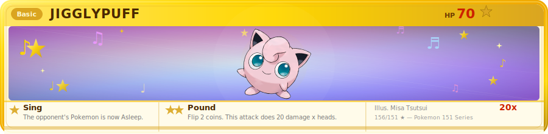

<div align="center">


# ✨ TRAINER OLAYENCA


</div>

---

## 👤 About Me

<div align="center">

| | |
|---|---|
| **Name** | Olayinka Otuniyi |
| **Role** | Senior Software Engineer |
| **Company** | [Elsevier](https://www.elsevier.com) |


</div>

---

## 📋 POKÉDEX ENTRY

<table>
<tr>
<td width="58%" valign="top">

```json
{
  "trainer":  "Olayenca",
  "dex_no":   "#039 — Jigglypuff",
  "species":  "Fullstack Developer",
  "type":     ["Normal", "Fairy"],
  "ability":  "Normalize — ships clean code",
  "location": "Building in the wild 🌍",
  "moves": [
    "JavaScript ⚡",
    "Node.js  🌿",
    "React    💫",
    "TypeScript 🧊"
  ],
  "base_stats": {
    "build_speed":  95,
    "code_quality": 88,
    "debugging":    90,
    "collab":      100
  },
  "caught_with": "☕ Coffee Ball"
}
```

</td>
<td align="center" valign="top">


**Jigglypuff — Normal / Fairy**

*"Sings a lullaby… then ships at dawn."*

</td>
</tr>
</table>

---

## ⚔️ MOVE SET — TECH STACK

<div align="center">

**⚡ Electric — Frontend**


**🌿 Grass — Backend**


**🌊 Water — Database**


**🔥 Fire — Tools & DevOps**


</div>

---

## 🏆 BATTLE STATS

<div align="center">


<br/><br/>


</div>

---

## 🎵 Contributions

<div align="center">




</div>

---

<div align="center">


*Gotta ship 'em all!* 💗


</div>
